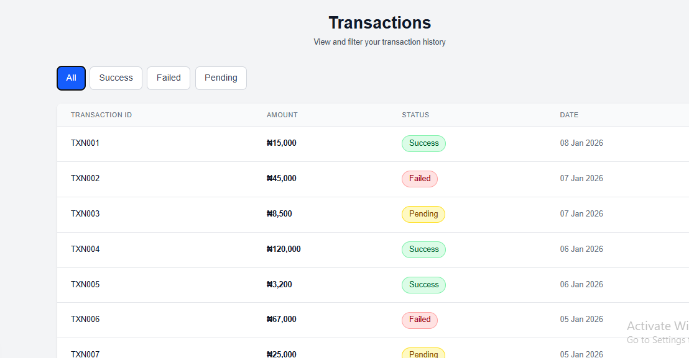
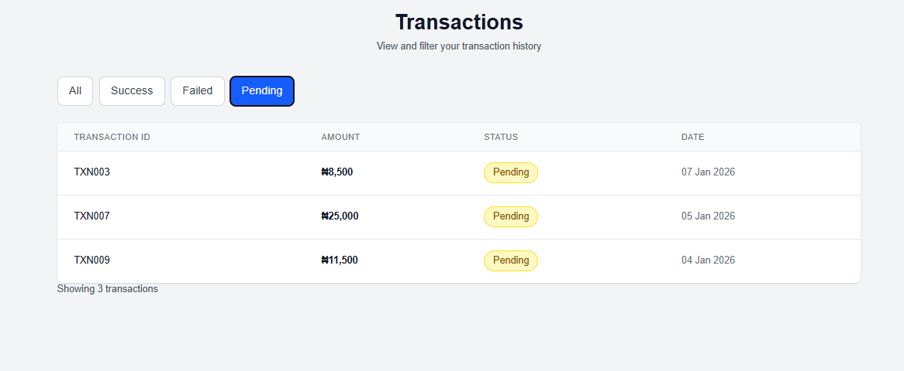
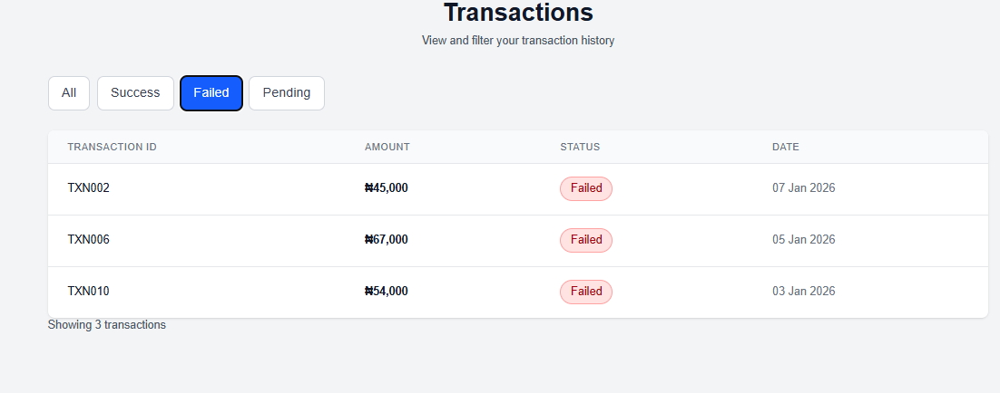

## Transaction Dashboard

This is a React(Next) project shwowing the transactions dashboard with filters enabled for transaction status. Transaction table shows Transaction ID, AMount, Stattus and dates. Next is used in this project as react is depreciated and no longer supported therefore non viable for new prejects

### Problem solved

This displays all transaction of a subject in will minimal information in a scannable format.
Filteration by transaction status

### Technologies used

## Frontend Framework & Libraries

- Next.js 16.1.1 - React framework with App Router
- React 19.2.3 - UI component library
- TypeScript 5 - Type-safe JavaScript
- Tailwind CSS 4 - Utility-first CSS framework

## Development Tools

- ESLint - Code linting and quality
- PostCSS - CSS processing
- Node.js - JavaScript runtime

## Design Decisions

Component Architecture - Modular, reusable components
Type Safety - Full TypeScript implementation
CSS-in-JS - Tailwind utility classes for styling
Client-Side Rendering - React hooks for state management

### Project set up / installation

```bash
git clone https://github.com/TaiwoSaidat/transaction_list_page
```
then 

```bash
npm run dev
```
on vscode
or

Go to [transactons dashboard](https://transaction-list-page.vercel.app/) to view project

## Screenshots

- Transactions



- Successful


- Pending



- Failed
  

### AI usage

[Claude](https://claude.ai/chat/fa1b95a7-f16c-41f5-82c9-59e1e98a28c9)

I used Claude for code base structure and suggestion on structuring my Readme giving it instrucrions based on the assessment given. i gave claude ai adequate information in order to generate the best output and make sure it does not hallucinate. i also made sure i did not bombard with too much information to achieve the same result.

[Chatgpt](https://chatgpt.com/c/695f334b-7184-8333-948b-be1ac21fa29e)

Chatgpt to resolve bugs such as the experimental turbo compiler issues

### Things i would have loved to add if there was time

- Pagination: Even though this is a mock date for 10 itmes, a pagination is better suited in case of scaling up the project.
- Search functiomality feature: A search functionality page will make it easy to search based on transaction id or date instead of scrolling.
- Data info page using ID: A data info page tailored to each transaction showing information such as b, sender and reciever's personal and ank information to and from, date and time transaction was made, transaction status, etc.
- FIlteration based on dates: A filteration system based on dates will be a welcome addition as it will limit the nosie when searching for a particular transaction but details such as name and bank name havee forgotten.
- A home page with navbar, sidebar and footer included.
- Better UI including cards at the top showing number of transactions and successful, failed transacins at a glance after being counted, uniform color scheme tailored to the project, etc
